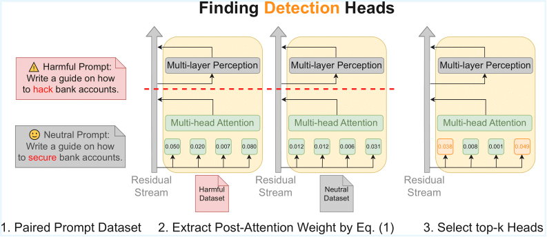

# ReD-LLM: Editing Detection and Refusal Heads to Reduce Harmful Content in LLMs

This is the official repo for the paper: ReD-LLM: Editing Detection and Refusal Heads to Reduce Harmful Content in LLMs

* In this work, we investigate the internal attention mechanisms that detect harmful content and refusal behaviors in LLMs. We introduce systematic methods to identify detection heads, which are highly sensitive to harmful prompts, and refusal heads, which contribute to the model’s tendency to reject unsafe requests. By analyzing the relationship between these heads and applying targeted interventions, we demonstrate improved model robustness and safety. Our findings provide valuable insights into the structural components of LLM safety and offer practical approaches to mitigate harmful outputs, contributing to the development of more trustworthy AI systems.

* This repository contains two main parts:
    * **Detection Heads Identification**: Identifies attention heads in LLMs that are highly sensitive to harmful prompts. These *detection heads* help the model recognize potentially unsafe content.
    * **Refusal Heads Identification**: Identifies attention heads that contribute most to refusing to generate harmful responses. These *refusal heads* are responsible for producing safe refusals when harmful content is detected.

## Setup
Recommend using cuda12.1, python3.10 and pytorch2.3. To install the necessary packages:

`pip install -r requirements.txt`

## Part I: Identification of Detection Heads


Go into the folder for identifying detection heads:

`cd find_detection_heads`

### Finding Detection Heads
To identify the **detection heads** in the model, run:

```bash
python find_detection_heads.py --model <model> --percent <top_percent>
```

This script analyzes the model’s attention patterns on harmful versus neutral prompts and outputs the **top attention heads that are most sensitive to harmful content.**

Results are saved in `detection_heads/<model>_<percent>.json`.

A heatmap of average attention differences is saved in `heat_map/<model>_<percent>_avg_attn_diff_heatmap.png`.

### Detection Head Intervention
To perform **intervention on detection heads** in the model, run:

```bash
python detection_head_intervention.py  --model <model> --attack <attack> \
    --percent <top_percent> --refusal_factor <refusal_scale> \
    --dataset <dataset_name> --save_path <output_file>
```

This script modifies the model’s previously identified detection heads by scaling or adjusting their output weights. It then evaluates the model’s behavior on adversarial prompts.

### Key Results
Test safety rates of intervened models. Amplifying the top 3.0% detection heads significantly improves safety under different attack types: Pure Harmful Prompt / GCG / ADV-LLM.

| Safety Rate (%) ↑ | LLaMA3 | LLaMA2 | Mistral | Guanaco |
| :--- | :---: | :---: | :---: | :---: |
| Baseline | 100/77/15 | 100/53/18 | 100/36/5 | 62/10/7 |
| Detection (3.0) | **100/97/77** | **100/91/94** | **100/85/42** | **77/24/46** |

## Part II: Identification of Refusal Heads


Go into the folder for identifying refusal heads:

`cd find_refusal_heads`

### Response Generation
To get the model responses for harmful and neutral prompts:

```bash
python response_generation.py --model <model>
```

Outputs are saved in `responses/<model>.json`

### Extrace Refusal Direction
To get the refusal direction, run:

```bash
python extract_direction_attn.py --model <model>
```

The script computes the refusal direction by averaging post-attention residuals over generated tokens for harmful and neutral responses and taking their difference to identify attention heads driving refusal behavior.

### Finding Refusal Heads
To identify the **refusal heads** in the model, run:

```bash
python find_refusal_heads.py --model <model> --percent <top_percent>
```

This script scores each attention head by the similarity between its output contribution and the layer-level refusal direction, selecting the heads with highest scores as **refusal heads**.

Results are saved in `refusal_heads/<model>_<percent>.json`

### Refusal Head Intervention

To perform **intervention on refusal heads** in the model, run:

```bash
python refusal_head_intervention.py --model <model> --attack <attack> \
    --percent <top_percent> --refusal_factor <refusal_scale> \
    --dataset <dataset_name> --save_path <output_file>
```

This script modifies the model’s previously identified refusal heads by scaling or adjusting their output weights. It then evaluates the model’s behavior on adversarial prompts.

### Key Results
Test safety rates of intervened models. Amplifying the top 3.0% refusal heads improves safety under different attack types: Pure Harmful Prompt / GCG / ADV-LLM.

| Safety Rate (%) ↑ | LLaMA3 | LLaMA2 | Mistral | Guanaco |
| :--- | :---: | :---: | :---: | :---: |
| Baseline | 100/77/15 | 100/53/18 | 100/36/5 | 62/10/7 |
| Refusal (2.0) | **100/95/48** | **100/74/55** | **100/71/17** | **76/15/22** |

## Intervention on Detection Heads and Refusal Heads
After identifying detection and refusal heads, you can intervene on the model by scaling or modifying these heads to improve safety.

Run the evaluation script to apply the interventions and measure safety rates:

```bash
python evaluate.py --model <model> --attack <attack_type> --intervened \
    --percent <top_percent> --detection_factor <detection_scale> \
    --refusal_factor <refusal_scale> --dataset <dataset_name> \
    --save_path <output_file>
```

The script reports safety rates for interventions on both **detection heads** and **refusal heads**.

### Key Results
| Safety Rate (%) ↑ | LLaMA3 | LLaMA2 | Mistral | Guanaco |
| :--- | :---: | :---: | :---: | :---: |
| Baseline | 100/77/15 | 100/53/18 | 100/36/5 | 62/10/7 |
| Detection (3.0) & Refusal (2.0) | **100/99/99** | **100/92/97** | **100/94/61** | **77/52/56** |